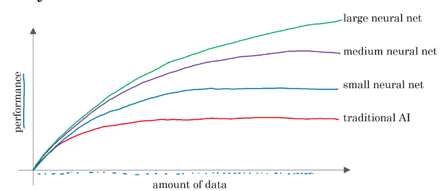
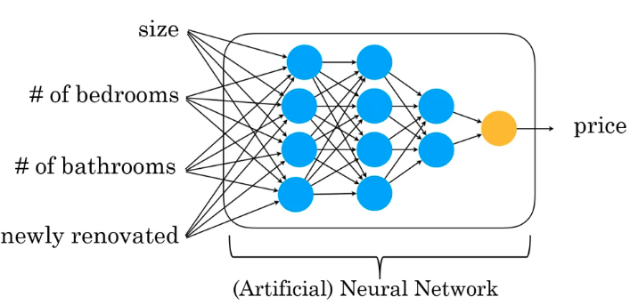
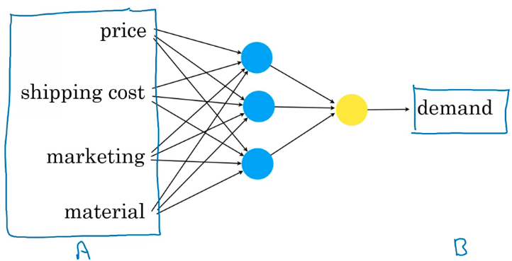
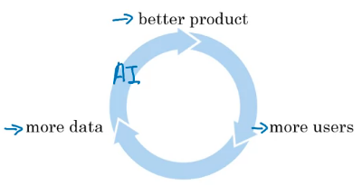
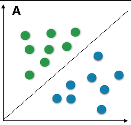

[Ref: Coursera - AI for Everyone](https://www.coursera.org/learn/ai-for-everyone/)

**Artificial Intelligence** can be thought of in two categories:
- Artificial Narrow Intelligence (ANI)
Examples: self driving cars, smart speaker, web search
- Artificial General Intelligence (AGI)
Examples: do anything a human can do

## Supervised Learning
| Input (A)         | Output (B)              | Application        |
| :---------------- | :---------------------- | ---------------:   |
| Email             | Spam (1/0)              | Spam filtering     |
| Audio             | Text transcript         | Speech recognition |
| Ads, user click   | click (1/0)             | Online ads         |
| Image, radar info | position of other cars  | Self driving cars  |

Supervised Learning has grown given the growth in the amount of big-data availability, performance of computational resources and, evolution of Neural Networks.

Following is an example of a data set, which can be used to price homes.

| Size of house | # of rooms | Garage  Count | Price |
| :------------ | :--------- | :------------ | ----: |  
| 3,500         | 4          | 1             | 500K  |
| 1,500         | 2          | 0             | 200K  |
| 2,000         | 3          | 2             | 250K  |

_Inputs (A): Size of house, # of rooms and Garage Count._
_Output (B): Price of home_

Depending on the scenario, we can choose the relevant features as input (A) to ascertain the appropriate output (B).

### Acquiring Data
 - Manual labeling for both input and output values
 - From observing system and user behaviors:
  - User purchasing a product or not
  - Machine or system behavior: system metrics and statistics
  - Data downloaded from the web

### Use / Misuse of Data

Use initial data, feed it to AI and collect feedback to improve data being collected. There is no need to wait for a large data set, prior to feeding an initial data to AI.

- Incorrect data / labels: unknown or missing values and labels
- Unstructured data: multiple types of data: text, speech, audio
- Structured Data: Spreadsheets, Databases etc.,

### AI terminology

For the use case of predicting home prices, Machine Learning would aid in developing a production application for predicting house prices.
Whereas, Data Science would be helpful in generating insights such as:
 - Homes with 3 bedrooms are more expensive than 2 bedrooms of similar size
 - Newly renovated homes have a x% premium

| Machine Learning | Data Science |
| :------------ | --------------: |
| "Field of study that gives computers the ability to learn without being explicitly programmed" - Arthur Samuel | Science of extracting knowledge and insights from data |

### Deep Learning

_ANN - given input features (A), produces an output B_

### AI first company
- Strategic data acquisition (ex: freemium models wherein a version of an application would be made available for free to gather user data and learn from user activity)
- Unified data warehouse: not staggered across various teams in a company
- Persuasive automation
- New job roles: Machine Learning Engineer, Data Scientist etc.,

### AI transformation
1. Execute pilot projects to gain momentum
2. Build an in-house AI team
3. Provide broad AI training
4. Develop an AI strategy
5. Develop internal and external communications

**What Machine Learning can and can't do**

Supervised Learning: as an imperfect rule, anything you can do within a second of thought, we can probably automate now or soon. Examples include: spam detection, picture identification etc.,

**What makes an ML problem easier**

1. Learning a 'simple' concept in less than a second
2. Lots of available data - for both input features and output

**ML works poorly when**
1. Learning complex concepts from small amounts of data
2. It's asked to perform on new types of data

### Non technical explanation of Deep Learning

For the following scenario of demand prediction, one can surmise that factors such as: affordability, perceived value etc., would play role in predicting demand.

A Neural Network would figure out the most accurate function to predict an output (B), given enough volume of input data (A). Meaning, we don't have to come up with parameters such as: affordability, perceived quality etc.,

For face recognition, a neural network layers would initially identify 'edges', followed by 'parts of objects' and subsequently, 'shapes of faces', eventually detecting the identity of a person.

### Key steps of a Machine Learning project

_Scenario: speech to text translation_

1. Collect data from various users
2. Train a model to convert audio signals (Input: A) to detect a keyword such as: 'Alexa' or a phrase such as: 'Hi there'
3. Deploy the model
 - It may not work well with newly deployed data (Ex: British accents that the model hasn't been trained on)

Similarly, for the scenario of self driving cars, the steps would be:
1. Collect data ( images and relative position of other cars)
2. Train model: iterate many times
3. Deploy model:
 - Get data back
 - Maintain and update the model

### Workflow of a Data Science project

_Example: optimizing sales funnel_
User flow: visit website -> Shopping page -> Add to Cart -> Checkout

Key steps:
1. Collect data
2. Analyze data

Sample insights:
- International shipping costs
- Fewer Ads should be shown when fewer shoppers are on the site
- Suggest hypothesis / actions
 - Re-analyze new data periodically

### Choosing an AI project

An AI project should comprise of AI knowledge and domain knowledge: this would be an collaboration between 'what AI can do' alongside 'business/domain knowledge'

### Brainstorming framework
- Think about automating tasks rather than automating jobs
- What are the main drivers of business value?
- What are the main pain points in your business?

**Acceptance criteria**: a goal of detecting defects with 95% accuracy. Provide AI team a dataset against which the performance would be measured.

**Technical diligence**
- Can AI system meet desired performance (Ex: 95% speech-to-text accuracy)
-  How much data is needed
- Engineering timeline

**Business diligence**
- Lower costs
- Increase revenue
- Launch a new product or business

### Building an AI project
_Example scenario: hey device, tell me a joke_

1. Trigger word/wakeword detection
2. Speech recognition (speech to text)
3. Intent recognition (ex: weather, time, joke)
4. Execute command

### AI transformation playbook

It's important for the initial project to **succeed** rather than deliver the most value (this phase will help gain momentum). Show traction within 6 to 12 months.

**Develop AI Strategy**
- Leverage AI to create an advantage specific to your industry sector
- Design strategy aligned with the 'Virtuous cycle of AI'
- Consider creating a data strategy
 - Strategic data acquisition
 - Unified data warehouse
- Create network effects & platform advantages
 - AI can be an accelerator

Virtuous cycle: a better product results in more users, which in-turn results in more data.

### Unsupervised Learning

_Scenario: clustering potato chip sales_

Given data, without any specific desired output labels, find something interesting about the data. Unsupervised Learning unlike Supervised Learning doesn't involve inputs (A) with a desired output (B).

### Transfer Learning
_Scenario: Car detection -> Golf car detection_

Learn from task A and use knowledge to help on task B.

### Reinforced learning
What's the best way to say, fly a helicopter - given that it's equipped with tools such as: accelerometer, gyroscope etc.,
Reinforced learning uses a "reward signal" as a training mechanism to automatically help maximize it's rewards.

Other aspects of AI include: Generative Adversarial Network (GAN) to synthesize new images from scratch and Knowledge Graph

### Limitations of AI
We should have a realistic view of AI and it's possibilities.

**Limitations of AI**
- Performance limitations
- Explainability is hard (but sometimes doable)
- Biased AI outcomes through biased data
 - AI learning unhealthy stereotypes

**Combating bias**
- 'zero out' the bias in words
- Use more inclusive data
- Transparency and auditing processes

**Adverse use cases**
- Deep fake
- Generating fake comments and reviews

### AI & Developing Economies
- Developing economies should focus on AI & strengthen a country's vertical industries
- Public / private sector partnerships to accelerate development
- Invest in education
