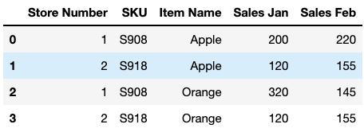
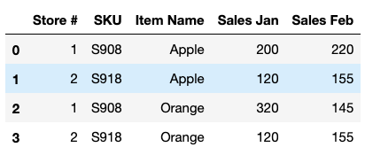
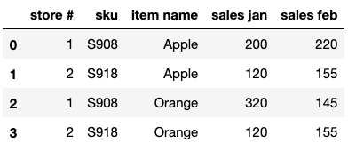
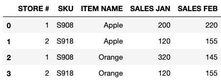

[Ref: Coursera - Introduction to Data Science in Python](https://www.coursera.org/learn/python-data-analysis)

### Series Data Structure
Series can be thought of a cross between a list and a dictionary. The items are **stored in an order** and there are labels with which data can be retrieved.

A Series would be two columns of data wherein, the first is a special index (similar to keys in a dictionary) and the second is for data. Note that the data column has it's own label and can be retrieved using a ```.name``` attribute. Series can be handy when merging multiple columns of data.

Example below uses a list of strings to create a Pandas Series. The resulting Series has a data type of ```object```.
```python
import pandas as pd
letters = ['Z', 'Y', 'X']
pd.Series(letters)

# 0    Z
# 1    Y
# 2    X
# dtype: object
```

Using a list of integers to create a Pandas Series. The resulting Series has a data type of int64.
```python
nums = [22, 11, 99]
pd.Series(nums)

# 0    22
# 1    11
# 2    99
# dtype: int64
```

```python
letters = ['Z', 'X', None]
pd.Series(letters)

# 0       Z
# 1       X
# 2    None
# dtype: object
```

Pandas represents ```NaN``` as a floating point number and rest of the values are type casted to floating point numbers.
```python
nums = [1, 2, None]
pd.Series(nums)
# 0    1.0
# 1    2.0
# 2    NaN
# dtype: float64
```

```NaN``` is not equivalent to ```None```
```python
np.nan == np.nan # false
```

Use the following to test for the presence of not a number.
```python
np.isnan(np.nan) # True
```

Using a dictionary object to create a Pandas Series.
```python
letter_pts = { 'A': 10, 'B': 8, 'C': 6}
s = pd.Series(letter_pts)
s.index
# Index(['A', 'B', 'C'], dtype='object')
```

Using a list of tuples to create a Pandas Series object.
```python
list_tuples = [('A', '1'), ('C', '3')]
pd.Series(list_tuples)

# 0    (A, 1)
# 1    (C, 3)
# dtype: object
```

An index can also be provided as a list for creating a Series.
```python
grade_pt_series = pd.Series([10,8,6], index=['a', 'b','c'])
grade_pt_series
# a    10
# b     8
# c     6
# dtype: int64
```

```NaN``` is returned when the given index doesn't have a corresponding value in the Series
```python
game_scores = { 'Bob': 99, 'Jane': 22, 'Jade': 6}
s = pd.Series(game_scores, index=['Bob', 'Jane', 'Zen'])
s
# Bob     99.0
# Jane    22.0
# Zen      NaN
# dtype: float64
```
### Quering a Series
A Pandas series can be queried either by an index position or an index label.
- ```iloc``` attribute can be used to query by a numeric location.
- ```loc``` attribute can be used to query by an index label.

Note that ```iloc``` and ```loc``` are attributes and not methods.

Iterating through a Pandas Series to obtain total sum.
```python
nums_series = pd.Series([10, 20, 30])
total = 0
for num in nums_series:
    total += num
total # 60
```

Using numpy to find the total sum of a Series.
```python
num_series = pd.Series([10, 20, 30])
np.sum(num_series) #60.0
```
To evaluate the performance difference between using a basic for loop versus using numpy's builtin methods, the ```timeit``` magic method can be used.

```python
%%timeit -n 100
rand_nums = pd.Series(np.random.randint(0, 1000, 10000))
total = 0
for num in rand_nums:
    total += num
total/len(rand_nums)
# 1.25 ms ± 6.44 µs per loop (mean ± std. dev. of 7 runs, 100 loops each)
```

```python
%%timeit -n 100
rand_nums = pd.Series(np.random.randint(0, 1000, 10000))
# generate: 10K random nums between 0 and 1000
total = np.sum(rand_nums)
total / len(rand_nums) # average
# 229 µs ± 16.7 µs per loop (mean ± std. dev. of 7 runs, 100 loops each)
```

#### Broadcasting
Broadcasting can be used to apply an operation to every value in a given series thereby changing the series.

Per example below: the rudimentary implementation using  ```iteritems()``` can be replaced by leveraging broadcasting.

```python
s = pd.Series([9, 7, 6])
for label, value in s.iteritems():
    s.set_value(label, value+3)
s
# 0    12
# 1    10
# 2     9
# dtype: int64
```

```python
s = pd.Series([9, 7, 6])
s += 2
s
# 0    11
# 1     9
# 2     8
# dtype: int64
```

Pandas Series can consist of data values and index labels with **mixed types**.
```python
s = pd.Series([9, 7, 6])
s.loc['Name'] = 'Jade'
s
# 0          9
# 1          7
# 2          6
# Name    Jade
# dtype: object
```

**Appending** one series to another returns a new series and doesn't modify the existing series.

```python
good_grades = pd.Series({'A': 1, 'B': 2})
low_grades = pd.Series([3,3,4,4], index=['C', 'C', 'D', 'D'])
all_grades = good_grades.append(low_grades)
all_grades
# A    1
# B    2
# C    3
# C    3
# D    4
# D    4
# dtype: int64
```

As the index label 'C' corresponds to multiple values, a series is returned here.

```python
all_grades['C']
# C    3
# C    3
# dtype: int64
```

```python
type(all_grades['C'])
# pandas.core.series.Series
```

### DataFrame Data Structure
A DataFrame is conceptually a two dimensional series object with an index and multiple columns of content with each column has a label.  A DataFrame can be thought of as a two axes labeled array.

Creating a DF using a group of series. Here, each series represents a row of data.

```python
city1_weather = pd.Series({'Sunday': 30.2, 'Monday': 24, 'Tuesday': 30.8})
city2_weather = pd.Series({'Sunday': 24.1, 'Monday': 26, 'Tuesday': 26.3})

df = pd.DataFrame([city1_weather, city2_weather], index=['city1', 'city2'])
df.head()
```
|           | Sunday | Monday     | Tuesday |
| :-------- | :--------- | :-------| ----: |  
| city1     | 30.2       | 24.0    | 30.8  |
| city2     | 24.1       | 24.0    | 30.8  |


Creating a DF using a list of dictionaries. Each dictionary represents a row of data.
```python
weather_data = [{'Sunday': 30.2, 'Monday': 24, 'Tuesday': 30.8, 'Week': 1},
               {'Sunday': 26.2, 'Monday': 23.8, 'Tuesday': 28, 'Week': 1},
               {'Sunday': 26.2, 'Monday': 23.8, 'Tuesday': 28, 'Week': 2}]

df = pd.DataFrame(weather_data, index=['city1', 'city2', 'city1'])
df
```
|           | Sunday    |	Monday |	Tuesday |	Week |
| :-------- | :-------- |   :------|  :-------  |   ----:|
| city1     | 30.2      |	24.0   |     30.8	|   1    |
| city2	    | 26.2      |	23.8   |	 28.0	|   1    |
| city1	    | 26.2      |	23.8   |	 28.0	|   2    |

Extract data using ```.iloc``` and ```.loc``` attributes,
Similar to Series, as a DataFrame is two dimensional: passing a single value to the ```loc``` operator will return the **Series** if there's only one row to return

```python
df.loc['city2']
# Sunday     26.2
# Monday     23.8
# Tuesday    28.0
# Week        1.0
# Name: city2, dtype: float64
```
**Note**: name of the series is returned as the index value, column name is also included in the output.

```python
type(df.loc['city2']) # pandas.core.series.Series
```

**Note**: indices and column names along either axes horizontal or vertical can be non-unique

As the following statement matches multiple rows, a new DataFrame is returned.
```python
df.loc['city1']
```
|           | Sunday    |	Monday |	Tuesday |	Week |
| :-------- | :-------- |   :------|  :-------  |   ----:|
| city1     | 30.2      |	24.0   |     30.8	|   1    |
| city1	    | 26.2      |	23.8   |	 28.0	|   2    |

```python
type(df.loc['city1']) # pandas.core.frame.DataFrame
```

Data based on multiple axes can be selected with parameters to ```.loc``` operator. One for the row index and the other for the column name.
```python
df.loc['city1', 'Sunday']
# city1    30.2
# city1    26.2
# Name: Sunday, dtype: float64
```

Transposing a dataframe pivots all of the rows into columns and all columns into rows
```python
df.T
```
|           | city1 |	city2 |	city1 |
| :-------- | :---- | :------|   ----:|
| Sunday	| 30.2	| 26.2   |	26.2 |
| Monday	| 24.0	| 23.8   |	23.8 |
| Tuesday	| 30.8	| 28.0   |	28.0 |
| Week	    | 1.0	| 1.0    |	2.0  |

Below are two approaches to fetch a column's data.
```python
df.T.loc['Sunday']
# city1    30.2
# city2    26.2
# city1    26.2
# Name: Sunday, dtype: float64
```

This is similar to column projection in relational databases. The result of a single column projection is a Series object
```python
df['Sunday']
# city1    30.2
# city2    26.2
# city1    26.2
# Name: Sunday, dtype: float64
```

Operations can be chained together in both DataFrames and Series. For instance, fetch all rows pertaining to city1 and project a specific column name from just these rows.
```python
df.loc['city1']['Sunday']
# city1    30.2
# city1    26.2
# Name: Sunday, dtype: float64
```

```python
type(df.loc['city1']) # pandas.core.frame.DataFrame
type(df.loc['city1']['Sunday']) # pandas.core.series.Series
```

For ```.loc``` parameter a ```:``` can be passed as the first parameter (rows) to indicate a full slice of rows
```python
df.loc[:, ['Sunday', 'Tuesday']]
```
|       | Sunday	| Tuesday |
| :---  | :-------- | ----:   |
| city1  |	30.2    |	30.8  |
| city2  |	26.2    |	28.0  |
| city1  |	26.2    |	28.0  |

**Dropping data**: **drop()** function doesn't change the original data but, returns a copy of the DataFrame with given rows removed. Default is the row axis or 0.
```python
df.drop('city2')
```

|       | Sunday  |	Monday | Tuesday  |	Week   |
| :---- | :----   | :---  | :-------- | ----:  |
city1	| 30.2	  | 24.0  |	30.8      |	1 |
city1	| 26.2	  | 23.8  |	28.0      |	2 |

To drop a column, axis parameter can be set to a value of 1
```python
df.drop('Sunday', axis=1)
```
|       | Monday  |	Tuesday	| Week |
| :---- | :----   | :---  | :----: |
city1   |	24.0  |	30.8 |	     1 |
city2   |	23.8  |	28.0 |	     1 |
city1   |	23.8  |	28.0 |	     2 |

Using broadcasting, a default value can be set for a new column and this takes immediate effect.
```python
df['DefaultWeather'] = 15
df
```
|       | Sunday  | Monday	  | Tuesday	| DefaultWeather |
| :---- | :-----  | :-------- | :----   | ---: |
| city1 |	30.2  |	24.0      |	30.8    | 15 |
| city2	| 26.2	  | 23.8	  | 28.0	| 15 |
| city1 |	26.2  |	23.8      |	28.0    | 15 |

### DataFrame Indexing and Loading

Read a CSV file using Pandas into a DataFrame.
```python
import pandas as pd
df = pd.read_csv('sales.csv')
df.head()
```



```rename()``` function can be used to rename columns in a DataFrame.
```python
new_df = df.rename(columns={
    'Item Name': 'Product Name',
    'Store Number': 'Store #',
    'Sales Feb': 'Sales'})
new_df.head()
```


The ```rename()``` method can also be passed with a ```mapper``` parameter: which is a function definition that can be applied to respective columns or rows - specified via ```axis``` parameter (1 indicates columns, 0 indicates rows).

```python
new_df = new_df.rename(mapper=str.lower, axis=1)
new_df.head()
```


Using **list comprehension**, a function can be applied across column names to change the naming format from lower to uppercase for instance.
```python
cols = list(new_df.columns) # convert indexing variable to a list
cols = [x.upper().strip() for x in cols] # list comprehension
new_df.columns = cols
new_df.head()
```


### Querying a DataFrame

### Missing Values

### Manipulating a DataFrame
